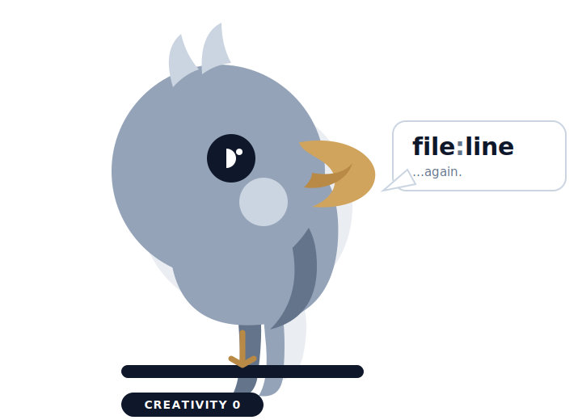

# mirror-design 🪞

[English](README.md) · **한국어**

<p align="center">
  
</p>

**디자이너가 없나요? 여러분의 기존 화면이 곧 디자인 시스템입니다.**

mirror-design은 새 프론트엔드 화면을 *코드베이스에 이미 있는 것을 그대로 비추어* 계획하고 구현하는 [Claude Code](https://claude.com/claude-code) 스킬입니다 — 모델이 아무것과도 맞지 않는 그럴듯한 UI를 지어내게 두는 대신에요.

거울은 아무것도 발명하지 않습니다 — 이미 있는 것만 비출 수 있죠. 이 스킬도 같은 방식으로 새 화면을 만듭니다: 모든 요소는 기존 화면들에서 수집한, 검증된 조각의 반영입니다.

## 문제

AI 에이전트에게 "공지사항 관리 페이지 추가해줘"라고 하면 *거의* 맞는 화면이 나옵니다: 살짝 다른 테이블 스타일, 앱 어디에도 없는 필터 바, 우리 토큰과 비슷하지만-정확히는-아닌 색상. AI가 만드는 화면마다 UI가 조금씩 더 어긋나죠 — 바로 디자이너나 디자인 시스템이 막아줬을 일입니다. 대부분의 사내 도구엔 둘 다 없고요.

## 아이디어

여러분에게 없는 디자인 시스템은, 여러분이 가진 화면들 안에 이미 인코딩되어 있습니다. 그래서:

1. 요청받은 화면을 UI 요소로 **분해**합니다 (스켈레톤, 필터 바, 테이블, 배지, 페이지네이션, 빈 상태…).
2. **각 요소마다, 그것을 가장 잘 구현한 기존 화면을 찾습니다** — 취향이 아니라 grep 사용 빈도로. 5개 화면이 날짜 프리셋 버튼을 쓰고 커스텀 필(pill)은 0개다? 프리셋 버튼입니다. 필은 발명이 됩니다.
3. 승자 소스(`file:line`)에서 **실측 스타일 값을 추출**하고, 테마 토큰을 실제 hex/px로 해석합니다.
4. **리뷰 패키지를 생성**합니다: 참조 매핑 테이블(모든 요소 → 그 출처 `file:line`), 실측값*만*으로 그린 독립 실행형 HTML 목업, 팀 채팅에 붙여넣을 요약.
5. **멈춥니다.** 사람이 계획을 검토합니다. 승인될 때까지 수정을 반복합니다.
6. **구현** — 각 요소를 매핑된 소스에서 조립하고, 라우트/내비를 등록하고, 통과할 때까지 빌드합니다.

정직함을 지키는 두 개의 하드 게이트:

- **완결성 게이트** — 목업의 모든 요소는 매핑 테이블에 `file:line` 출처가 있어야 합니다. 출처 없음 → 그리지 않음. mirror-design은 대신 멈추고 질문합니다.
- **형제 일관성 게이트** — 한 화면에서 같은 역할의 요소는 같은 컨트롤을 씁니다. 서로 다른 참조 화면에서 왔다는 이유만으로 칩 필터 두 개 옆에 라디오 버튼 필터를 두지 않습니다.

## 설치

Claude Code 플러그인으로:

```
/plugin marketplace add kim-taehan/mirror-design
/plugin install mirror-design@mirror-design
```

또는 순수 스킬로 수동 설치:

```bash
git clone https://github.com/kim-taehan/mirror-design
cp -r mirror-design/skills/mirror-design ~/.claude/skills/        # 사용자 전역
# 또는: cp -r mirror-design/skills/mirror-design <your-repo>/.claude/skills/   # 프로젝트별
```

## 사용

여러분의 프론트엔드 저장소 안에서:

```
/mirror-design 공지사항 관리 페이지 추가: 카테고리 필터 있는 목록 + 상세 보기
```

두 개의 명시적 진입점:

```
/mirror-design:init            # .mirror-design/ 스캐폴드 + census 구축(또는 드리프트 점검)
/mirror-design:audit <경로>    # census 기준으로 화면 감사 — 판정 + before/after 목업
```

mirror-design이 만드는 모든 산출물은 하나의 워크스페이스 `.mirror-design/`에 들어갑니다 (census와 공용 목업 크롬은 커밋되는 팀 자산, `plan/` 작업물은 워크스페이스 자체의 `.gitignore`로 제외).

저장소에서 처음 실행하면 mirror-design은 **디자인 센서스**(`.mirror-design/census.md`)를 구축합니다: 토큰(실제값으로 해석), 사용 빈도순 공유 컴포넌트, 지배적 화면 스켈레톤, 반복 요소 패턴, 등록 지점의 실측 조사 — 각각 `file:line` 증거 포함. 이후 실행은 캐시를 재사용하되 신뢰하기 전에 항목을 재검증합니다. 커밋하세요 — 팀원들의 실행도 빨라집니다.

## 무엇을 리뷰하나

코드 작성 전, 계획 패키지:

| 요소 | 출처 화면 (file:line) | 재사용할 패턴 |
|---|---|---|
| 페이지 스켈레톤 | `AnnouncementList.tsx:35-38` | Header + ContentContainer |
| 필터 바 | `ChatlogList.tsx:264-277` | 날짜 프리셋 + 검색 필드 |
| 카테고리 배지 | `AnnouncementList.tsx:74-90` | CATEGORY_CONFIG 칩 |
| 딥 링크 | `DeploymentList.tsx:120-127` | useSearchParams 시드 |

…여기에 독립 실행형 HTML 목업(새 요소는 `NEW`, 수정된 요소는 `CHANGED` 배지), 그리고 선택적으로 스크린샷이 박힌 계획 PDF를 슬랙에 바로 던질 수 있습니다.

## 범위와 철학

- 프레임워크 무관: React/Vue/Svelte/Angular; MUI/AntD/Tailwind/직접 만든 토큰. mirror-design은 있는 것을 무엇이든 측정합니다.
- **창작 디자인 도구가 아닙니다.** 코드베이스에 어떤 요소의 선례가 없으면 mirror-design은 즉흥적으로 만들지 않습니다 — 멈추고 질문합니다. 기존 화면이 못생겼다면, mirror-design은 충실하게 또 하나의 못생긴 화면을 만들어 줍니다. 일관성이 곧 제품입니다.
- 계획과 구현은 언제나 사람 게이트로 분리됩니다. 그 게이트가 핵심입니다.

## 감사의 말

명령 구조와 감사(audit) 방법론(심각도 단계, 오탐 필터, 기본은-판정만)은 Dammyjay93의 [interface-design](https://github.com/Dammyjay93/interface-design)에서 영감을 받았습니다 — 철학의 정반대편에 있는 크래프트 중심 디자인 스킬로, 그쪽은 훈련된 원칙에서 디자인하고 mirror-design은 측정된 증거에서 복제합니다. 코드나 텍스트를 복사하지 않았으며, 구조적 아이디어를 증거-전용 판정 기준에 맞게 각색했습니다.

## 라이선스

MIT
